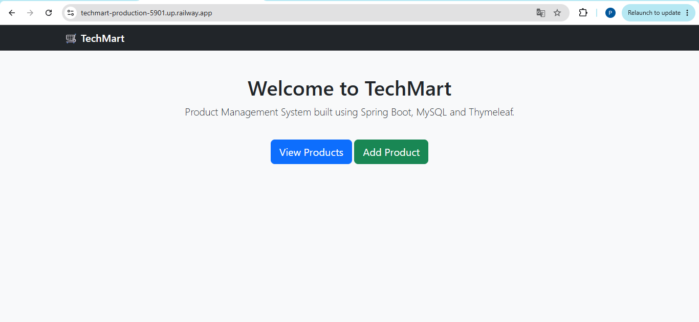
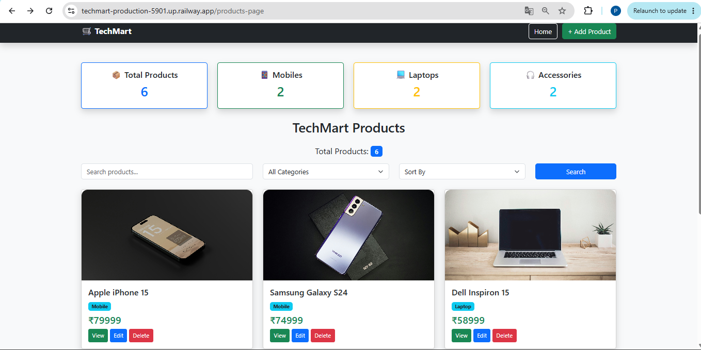
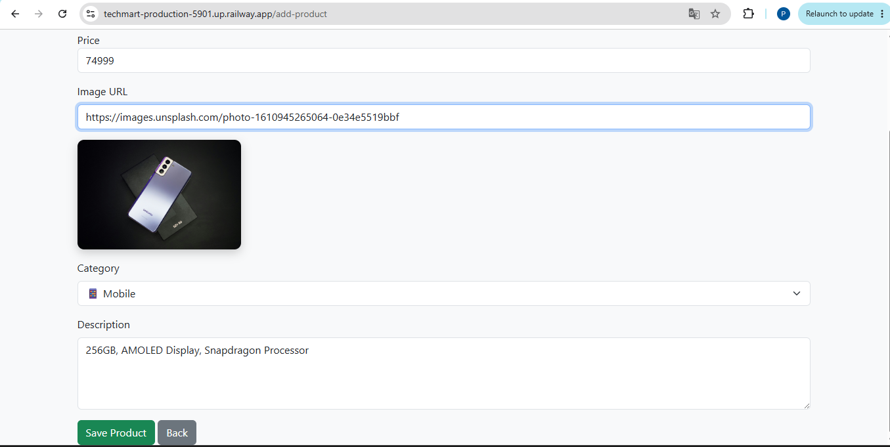
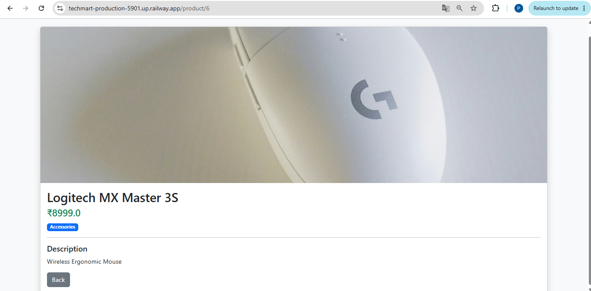
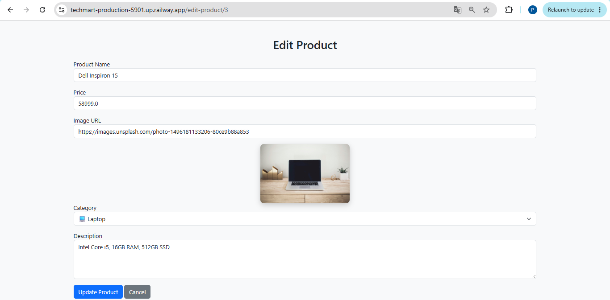

# 🛒 TechMart - E-Commerce Product Management System

TechMart is a Full Stack Java Spring Boot web application that allows users to manage products in an e-commerce store. It provides complete CRUD (Create, Read, Update, Delete) functionality with a clean and responsive user interface.

## 🚀 Live Demo

🔗 https://techmart-production-5901.up.railway.app

---

## ✨ Features

- ➕ Add Products
- 📋 View All Products
- ✏️ Edit Products
- 🗑️ Delete Products
- 🔍 Search Products
- 📂 Filter by Category
- 📊 Product Dashboard
- 📄 Product Details Page
- 📱 Responsive Bootstrap UI

---

## 🛠️ Technologies Used

- Java 21
- Spring Boot
- Spring MVC
- Spring Data JPA
- Thymeleaf
- MySQL
- Bootstrap 5
- Maven
- Git & GitHub
- Railway (Deployment)

---

## 🗄️ Database

- MySQL

---

## 💻 IDE

- Eclipse IDE

---

## 📸 Screenshots

### Home Page



### Products Dashboard



### Add Product



### Product Details



### Edit Product



---

## ⚙️ How to Run

1. Clone the repository

```bash
git clone https://github.com/Pavithra110/Techmart.git
```

2. Open the project in Eclipse.

3. Configure MySQL.

4. Update `application.properties` with your database credentials.

5. Run the Spring Boot application.

6. Open:

```
http://localhost:8080
```

---

## 👩‍💻 Author

**Pavithra C**

GitHub: https://github.com/Pavithra110
